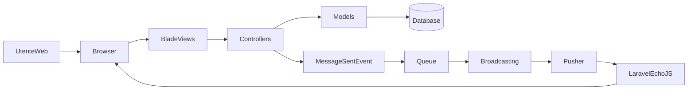
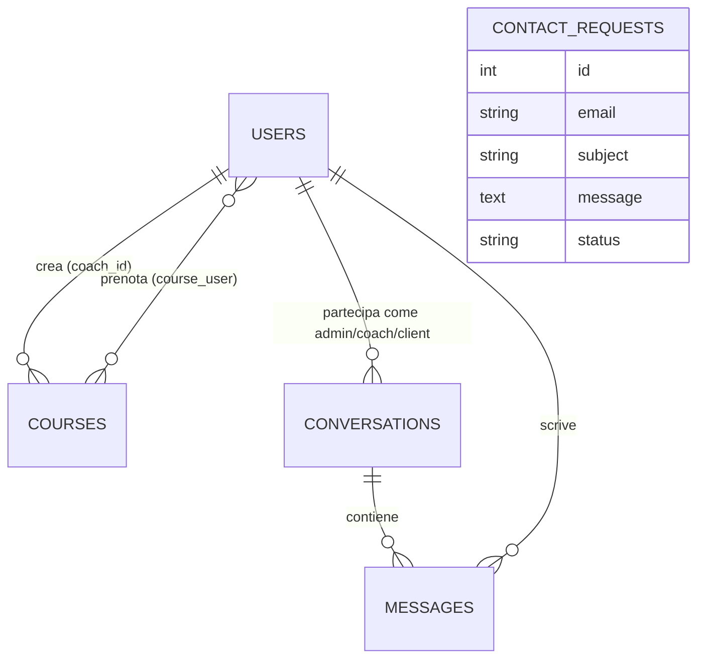

## 1. Introduzione al progetto

FitLifeMilano è un gestionale per centro fitness/palestra sviluppato in **Laravel** che copre sia la parte di **sito vetrina** (pagine pubbliche e form contatti) sia la parte di **applicazione gestionale** per tre tipi di utenti:

- **Admin**: gestisce l’intero sistema (utenti, corsi, prenotazioni, messaggi, richieste di contatto).
- **Coach**: gestisce e tiene traccia dei propri corsi e delle comunicazioni con i clienti.
- **Client**: prenota i corsi, visualizza lo storico e comunica con coach/admin tramite chat.

L’applicazione offre:

- **Area pubblica** con pagine informative (`index`, `corsi`, `chi-siamo`, `contatti`) e form di contatto.
- **Autenticazione** con login, logout e reindirizzamento automatico alla dashboard corretta in base al ruolo.
- **Gestione utenti** (creazione e amministrazione di admin/coach/client lato admin).
- **Gestione corsi** (creazione, modifica, cancellazione, capienza massima).
- **Prenotazione corsi** da parte dei client, con controllo di capacità e doppie prenotazioni.
- **Messaggistica realtime (chat)** tra admin, coach e client, basata su Laravel Broadcasting, Pusher e Laravel Echo.
- **Gestione profilo utente**, inclusa la **foto profilo** elaborata e salvata come BLOB nel database.

A livello tecnologico il progetto utilizza:

- **Laravel** (MVC, Eloquent ORM, queue, eventi di broadcast).
- **Blade** per le viste server-side.
- **Bootstrap** per l’interfaccia grafica.
- **Pusher + Laravel Echo** per la parte realtime della chat.
- **Laravel Telescope** per il monitoraggio e il debug in ambienti di sviluppo.

---

## 2. Struttura del codice e organizzazione delle cartelle

L’applicazione segue la struttura tipica di un progetto Laravel, con alcune convenzioni specifiche per i tre ruoli (admin, coach, client) e per la messaggistica.

### 2.1 Directory `app/Http/Controllers`

Contiene i controller che gestiscono la logica applicativa lato server.

- **Controller principali condivisi**
  - `AuthController`: gestisce login e logout degli utenti.
  - `ConversationController`: gestisce la chat lato coach/client (lista conversazioni, apertura chat, invio messaggi, marcatura come letti).
  - `ContactRequestController`: riceve e salva le richieste provenienti dal form contatti pubblico.
  - `ProfileController`: visualizza e aggiorna i dati del profilo utente, inclusa la foto profilo.
  - `ProfilePhotoController`: restituisce il contenuto binario della foto profilo salvata nel database o un’immagine di default.

- **Sottocartella `Admin`**
  - `AdminController`: controller principale dell’area admin. Gestisce:
    - Dashboard admin (statistiche, conteggi, messaggi non letti).
    - Gestione utenti (coach/client/utenti generici).
    - Gestione corsi (CRUD, iscrizioni/annullamenti iscrizione).
    - Gestione delle richieste di contatto (lista, dettaglio, risposta via email).
  - `AdminConversationController`: gestisce la chat lato admin (lista conversazioni, apertura chat, invio messaggi, marcatura come letti).

- **Sottocartella `Coach`**
  - `CoachController`: controller dell’area coach. Si occupa di:
    - Dashboard coach.
    - Lista e dettaglio dei corsi gestiti dal coach.
    - Accesso alla lista clienti per corso.

- **Sottocartella `Client`**
  - `ClientController`: controller dell’area client. Gestisce:
    - Dashboard client.
    - Flusso di prenotazione corsi (lista corsi prenotabili, dettaglio corso, iscrizione, annullamento).
    - Accesso alla sezione messaggi lato client.

### 2.2 Directory `app/Models`

Contiene i modelli Eloquent che rappresentano le entità principali del dominio:

- `User`: rappresenta gli utenti dell’applicazione (admin, coach, client). Contiene:
  - Attributi anagrafici, ruolo, credenziali.
  - Relazioni con corsi, conversazioni e messaggi.
  - Metodi di utilità (es. calcolo del numero di messaggi non letti, accessor per nome completo e URL foto profilo).

- `Course`: rappresenta un corso in palestra (giorno, orario, coach, capacità massima).
  - Relazioni con il coach creatore e con i client iscritti tramite pivot `course_user`.

- `Conversation`: rappresenta una conversazione di chat tra due ruoli (admin/coach/client).
  - Contiene i riferimenti agli utenti coinvolti e la relazione con i messaggi.

- `Message`: rappresenta un messaggio nella chat.
  - Include autore, conversazione, corpo del messaggio e informazione di lettura (`read_at`).

- `ContactRequest`: rappresenta una richiesta inviata dal form contatti pubblico.
  - Conserva email, oggetto, messaggio e stato di lavorazione.

### 2.3 Middleware e gestione dei ruoli

Nella directory `app/Http/Middleware` è presente il middleware:

- `CheckRole`: verifica che l’utente autenticato abbia uno dei ruoli richiesti per accedere a un determinato gruppo di rotte. È utilizzato in `routes/web.php` per delimitare le aree:
  - `role:admin` per le rotte dell’area admin.
  - `role:coach` per le rotte dell’area coach.
  - `role:client` per le rotte dell’area client.

Questo approccio consente di mantenere separati i permessi e la logica di business per ciascun tipo di utente.

### 2.4 Rotte (`routes/web.php` e `routes/channels.php`)

- **`routes/web.php`** definisce tutte le rotte HTTP dell’applicazione:
  - Rotte **pubbliche** per le pagine informative e il form contatti.
  - Rotte per il **login** (solo per ospiti, tramite middleware `guest`).
  - Rotte protette da **autenticazione** (`auth`) che includono:
    - Logout.
    - Selettore di dashboard in base al ruolo.
    - Rotte di profilo condivise.
    - Gruppo admin, gruppo coach e gruppo client, ciascuno protetto dal relativo middleware di ruolo.

- **`routes/channels.php`** definisce i canali **private** usati dal sistema di broadcast per la chat:
  - Canale `conversation.{id}` autorizzato solo agli utenti partecipanti a quella conversazione (admin/coach/client coinvolti).

### 2.5 Viste (`resources/views`)

Le viste Blade sono organizzate per area funzionale:

- **Area pubblica**
  - `index.blade.php`, `corsi.blade.php`, `chi-siamo.blade.php`, `contatti.blade.php`.

- **Area admin**
  - `admin/dashboard.blade.php` per la dashboard.
  - Sottocartelle `admin/courses`, `admin/users`, `admin/clients`, `admin/coaches`, `admin/messages`, `admin/chat` per le varie sezioni gestionali.

- **Area coach**
  - `coach/dashboard.blade.php`, viste `coach/courses/*` per la gestione corsi, `coach/messages/index.blade.php` per la chat.

- **Area client**
  - `client/dashboard.blade.php`, `client/booking.blade.php`, `client/courses/show.blade.php`, `client/messages/index.blade.php`.

- **Componenti condivisi**
  - Layout principale `layouts/layout.blade.php` con header e footer inclusi.
  - Componenti riusabili come `components/breadcrumb.blade.php`, `components/hero.blade.php`.
  - Partiale `partials/chat-scripts.blade.php` per la configurazione comune di Laravel Echo e Pusher.
  - Vista condivisa della chat `messages/chat.blade.php`.

### 2.6 Database (`database/migrations`, `database/seeders`, `database/factories`)

- La struttura delle tabelle è definita in **migration** come:
  - Tabelle applicative: `users`, `courses`, pivot `course_user`, `conversations`, `messages`, `contact_requests`.
  - Tabelle di infrastruttura: `jobs` (queue), `cache`, tabelle di **Laravel Telescope**.

- I **seeder** principali (`UserSeeder`, `CourseSeeder`) permettono di popolare un ambiente di sviluppo con utenti di esempio e corsi iniziali.

- Le **factory** (es. `UserFactory`) sono usate per generare utenti fittizi durante i test o seed più complessi.

---

## 3. Architettura logica e ruoli

L’architettura segue il modello **MVC** di Laravel:

- Le **Blade views** sono responsabili della presentazione HTML.
- I **controller** incapsulano la logica applicativa e si occupano di orchestrare richieste, validazione, chiamate ai modelli e selezione delle viste.
- I **modelli Eloquent** mappano le entità di dominio sul database relazionale e gestiscono le relazioni tra tabelle.

### 3.1 Ruoli applicativi

Il sistema prevede tre ruoli principali:

- **Admin**
  - Ha visione completa del sistema.
  - Può creare e gestire utenti di tipo coach e client.
  - Gestisce corsi, iscrizioni, richieste di contatto e conversazioni di chat con coach e client.

- **Coach**
  - Gestisce i propri corsi (lista e dettaglio).
  - Può vedere i client iscritti ai corsi che tiene.
  - Può comunicare con i client (e con altri coach/admin quando previsto) tramite chat.

- **Client**
  - Può prenotare i corsi disponibili in base a giorno/orario/capacità.
  - Può gestire le proprie prenotazioni (iscriversi/disiscriversi).
  - Può interagire via chat con coach e admin.

Il ruolo è memorizzato nel modello `User` e viene utilizzato sia a livello di **interfaccia** (diverse dashboard) sia a livello di **autorizzazione** (middleware `CheckRole`).

### 3.2 Middleware di ruolo e gruppi di rotte

In `routes/web.php` le rotte vengono raggruppate per responsabilità e protette da middleware:

- Gruppo **guest**:
  - Rotte accessibili solo agli utenti non autenticati (login e pagina area riservata).

- Gruppo **auth**:
  - Rotte comuni a tutti gli utenti autenticati (logout, selettore dashboard, profilo).
  - All’interno di questo gruppo, tre sottogruppi:
    - Gruppo **admin** con middleware `role:admin`, prefisso URL `admin` e prefisso di nome `admin.`.
    - Gruppo **coach** con middleware `role:coach`, prefisso `coach`, nome `coach.`.
    - Gruppo **client** con middleware `role:client`, prefisso `client`, nome `client.`.

Questa struttura rende chiara la separazione tra le tre aree applicative e facilita l’estensione futura (aggiunta di nuovi ruoli o moduli).

### 3.3 Architettura della messaggistica realtime

La messaggistica è realizzata tramite:

- **Eventi di Laravel**: l’evento `MessageSent` viene emesso ogni volta che un messaggio viene creato.
- **Broadcasting**: l’evento implementa `ShouldBroadcast` e viene inviato su un canale **privato** (`conversation.{id}`).
- **Queue**: il broadcasting può essere messo in coda su una specifica queue (`broadcasts`) per non bloccare la risposta HTTP.
- **Pusher + Laravel Echo**:
  - Sul frontend, `partials/chat-scripts.blade.php` configura `window.Echo` indicando chiave Pusher, cluster, endpoint di autenticazione dei canali privati e header CSRF.
  - Le viste della chat si iscrivono al canale privato della conversazione e ricevono in tempo reale i messaggi broadcastati.

In questo modo, la chat tra admin/coach/client è **sincrona** dal punto di vista dell’interfaccia, ma il backend rimane **scalabile** grazie all’uso delle queue.

### 3.4 Diagramma architetturale (alto livello)

Il seguente diagramma riassume i principali componenti e le loro relazioni:

---

## 4. Moduli funzionali principali

### 4.1 Area pubblica e contatti

L’area pubblica è accessibile senza autenticazione e fornisce le tipiche pagine di un sito vetrina:

- **Home** (`index.blade.php`): presentazione generale del centro fitness.
- **Corsi** (`corsi.blade.php`): panoramica dei corsi offerti.
- **Chi siamo** (`chi-siamo.blade.php`): informazioni sul team/azienda.
- **Contatti** (`contatti.blade.php`): form di contatto per richiedere informazioni.

#### Form contatti

- Il form sulla pagina `contatti` invia una richiesta POST a una rotta gestita da `ContactRequestController`.
- `ContactRequestController` valida i dati inseriti (email, oggetto, messaggio) e crea un record nel modello `ContactRequest`, salvandolo nella tabella `contact_requests`.
- L’admin può poi visualizzare, filtrare e rispondere alle richieste dalla propria area:
  - `AdminController` fornisce metodi per:
    - Elencare le richieste ricevute (con eventuale filtro per stato).
    - Visualizzare il dettaglio di una singola richiesta.
    - Inviare una **risposta via email** usando un template Blade dedicato (`emails/contact-response.blade.php`).

Questo modulo collega dunque la parte **pubblica** (form) con la parte **gestionale** (pannello admin e invio email).

### 4.2 Autenticazione e gestione accessi

L’autenticazione è gestita da `AuthController` e dalle configurazioni standard di Laravel (`config/auth.php`).

- **Login**
  - La rotta di login è accessibile solo a utenti **guest** (non autenticati) e mostra la view `area-riservata.blade.php`.
  - Il form invia i dati a una rotta POST (es. `/login-process`) che:
    - Valida credenziali.
    - Utilizza `Auth::attempt` per autenticare l’utente.
    - In caso di successo, reindirizza a un “selettore” (`/dashboard-selector`) che, in base al ruolo dell’utente, lo porta alla dashboard corretta.

- **Logout**
  - Una rotta protetta da `auth` chiama `AuthController@logout`, che:
    - Esegue `Auth::logout()`.
    - Invalida la sessione.
    - Reindirizza l’utente a una pagina pubblica o alla pagina di login.

- **Selezione dashboard**
  - Dopo il login, tutti gli utenti passano da `/dashboard-selector`.
  - Questo endpoint controlla il ruolo dell’utente (`admin`, `coach` o `client`) e lo reindirizza alla rispettiva dashboard:
    - Admin → `admin.dashboard`.
    - Coach → `coach.dashboard`.
    - Client → `client.dashboard`.

In questo modo, il codice di login rimane **unico** e la differenziazione dei ruoli è demandata alla logica del selettore e ai middleware di ruolo.

### 4.3 Gestione utenti (admin)

L’admin dispone di un modulo completo per gestire gli utenti del sistema.

- **Creazione di coach e client**
  - Tramite viste dedicate (`admin/coaches/create.blade.php`, `admin/clients/create.blade.php`) l’admin può creare:
    - Un nuovo **coach**, assegnandogli le credenziali e i dati anagrafici di base.
    - Un nuovo **client**, potenzialmente già associato ad alcuni corsi.
  - `AdminController` fornisce le azioni `createCoach`, `storeCoach`, `createClient`, `storeClient`, che:
    - Validano i dati.
    - Creano un utente con il ruolo corretto.
    - Eventualmente, impostano relazioni iniziali (es. corsi assegnati).

- **Gestione utenti esistenti**
  - Una vista indice (`admin/users/index.blade.php`) elenca gli utenti, con possibilità di filtri/ricerche.
  - Sono disponibili viste di dettaglio (`show`), modifica (`edit`) e conferma eliminazione.
  - `AdminController` gestisce il ciclo completo:
    - `usersIndex`, `userShow`, `userEdit`, `userUpdate`, `userDestroy`.

Questo modulo fornisce all’admin un controllo centrale su chi può accedere al sistema e con quale ruolo.

### 4.4 Corsi e prenotazioni

Il modulo corsi permette la gestione **amministrativa** dei corsi e la loro **prenotazione** da parte dei client.

#### Gestione corsi lato admin

- L’admin può:
  - Creare nuovi corsi (`courseCreate`, `courseStore`).
  - Modificare corsi esistenti (`courseEdit`, `courseUpdate`).
  - Eliminare corsi (`courseDestroy`).
  - Visualizzare il dettaglio di un corso, inclusi i client iscritti (`courseShow`).
  - Rimuovere un’iscrizione di un client a un corso (`courseUnenroll`).

- Ogni corso è associato a:
  - Un **coach responsabile** (relazione `coach` sul modello `Course`).
  - Alcuni **client iscritti** tramite la relazione many-to-many `users()` e la tabella pivot `course_user`.

- Le viste in `resources/views/admin/courses` presentano form di creazione/modifica e pagine di dettaglio con le informazioni principali:
  - Nome corso, descrizione, giorno della settimana, orario di inizio/fine, capacità massima, coach assegnato, numero di iscritti.

#### Vista corsi lato coach

- Il coach può accedere a una sezione dedicata (`coach/courses/index.blade.php`, `coach/courses/show.blade.php`) che mostra:
  - L’elenco dei corsi di cui è responsabile.
  - Per ogni corso, i client iscritti.
  - Eventuali collegamenti rapidi verso la chat con i client.

Questa parte è gestita da `CoachController`, che espone azioni come `coursesIndex` e `courseShow`.

#### Prenotazione corsi lato client

- Il client accede alla pagina di **prenotazione corsi** (`client/booking.blade.php`) tramite `ClientController@booking`.
  - Qui vede l’elenco dei corsi disponibili con:
    - Informazioni su coach, orario e capienza.
    - Stato della propria iscrizione (già iscritto / posti disponibili / corso pieno).

- Dal dettaglio corso (`client/courses/show.blade.php`, azione `courseShow`) il client può:
  - **Iscriversi** a un corso tramite `ClientController@enroll`:
    - Il metodo controlla che:
      - Il client non sia già iscritto a quel corso.
      - Non sia stata raggiunta la **capacità massima** impostata sul corso.
    - Se i controlli vanno a buon fine, viene creata la riga nella pivot `course_user`.
  - **Annullare la prenotazione** tramite `ClientController@cancelBooking`, che rimuove la riga corrispondente nella pivot.

Questo modulo mette insieme:

- Logica di **business** (controllo di capienza e doppie iscrizioni).
- Presentazione chiara (liste corsi, stato iscrizione).
- Relazioni Eloquent tra `User` e `Course`.

### 4.5 Messaggistica realtime (chat)

La chat è uno dei moduli più dinamici del progetto, e consente comunicazioni in tempo reale tra:

- Admin ↔ Client.
- Admin ↔ Coach.
- Coach ↔ Client.
- (Eventualmente) Coach ↔ Coach.

#### Modelli e struttura dati

- `Conversation`:
  - Rappresenta il “contenitore” logico di una chat tra due ruoli/utenti.
  - Contiene riferimenti agli utenti coinvolti (campi `coach_id`, `client_id`, `admin_id`, `other_user_id`).
  - Espone relazioni verso i modelli `User` e verso i `Message`.
  - Implementa metodi di utilità:
    - Per verificare se un dato utente è partecipante.
    - Per ricavare l’altro partecipante.
    - Per calcolare il numero di messaggi non letti per uno specifico utente.

- `Message`:
  - Ogni record rappresenta un messaggio con:
    - `conversation_id`, `user_id`, `body`, `read_at`.
  - Espone relazioni verso `Conversation` e `User`.
  - Fornisce scope/metodi per calcolare i messaggi non letti per una collezione di conversazioni.

#### Controller e viste

- **Lato coach/client**: `ConversationController`
  - `index()`: mostra la lista delle conversazioni dell’utente corrente, con:
    - Ultimo messaggio.
    - Numero di messaggi non letti per ogni conversazione.
  - `show()`: mostra la conversazione selezionata tramite la vista `messages/chat.blade.php`:
    - I messaggi vengono marcati come letti quando visualizzati dall’altro partecipante.
  - `storeMessage()`: salva un nuovo messaggio (autore = utente autenticato) e lancia l’evento `MessageSent`.
  - Metodi `startWithClient`, `startWithCoach`, `startWithCoachColleague`: aprono o creano una conversazione con l’utente richiesto e reindirizzano alla view della chat.

- **Lato admin**: `AdminConversationController`
  - Struttura analoga a `ConversationController` ma orientata all’admin:
    - `index()`: lista delle conversazioni dell’admin.
    - `show()`: apertura di una singola conversazione in `admin/chat/index.blade.php` (o vista simile).
    - `storeMessage()`: invio di un messaggio come admin.
    - `markAsRead()`: endpoint per marcare come letti i messaggi in una conversazione.

- **Viste**
  - `messages/chat.blade.php`: template principale della chat, usato trasversalmente da admin/coach/client (con eventuali adattamenti).
  - `client/messages/index.blade.php` e `coach/messages/index.blade.php`: liste delle conversazioni per ciascun ruolo.
  - `admin/chat/index.blade.php`: interfaccia di gestione conversazioni dal punto di vista admin.

#### Realtime con Pusher ed Echo

- Nel partial `partials/chat-scripts.blade.php` vengono:
  - Inclusi gli script di **Pusher** e **Laravel Echo**.
  - Inizializzato `window.Echo` con:
    - Chiave e cluster Pusher presi da `config('broadcasting.connections.pusher')`.
    - Endpoint di autenticazione (`/broadcasting/auth`).
    - Header con **token CSRF** per la protezione dalle richieste cross-site.

- Le viste della chat:
  - Si iscrivono al canale privato della conversazione (`Echo.private('conversation.' + conversationId)`).
  - Ascoltano l’evento `MessageSent` e aggiornano in tempo reale la lista dei messaggi.

### 4.6 Profilo utente e foto profilo

Il modulo profilo consente a ciascun utente autenticato di:

- Visualizzare i propri dati (nome, email, ruolo, corsi iscritti/creati).
- Caricare una **foto profilo** che verrà elaborata e salvata nel database.

#### Controller e viste

- `ProfileController`:
  - `show()`: recupera l’utente corrente con le sue relazioni principali (corsi prenotati, corsi creati se coach) e restituisce la view `profile/show.blade.php`.
  - `updatePhoto()`: gestisce l’upload della nuova foto profilo:
    - Valida il file (tipo, dimensioni).
    - Chiama un metodo sul modello `User` per elaborare l’immagine.
    - Salva nel database i dati binari e il MIME type.

- `ProfilePhotoController`:
  - `show(User $user)`: restituisce i byte della foto profilo (se presenti) con il giusto header `Content-Type`.
  - In assenza di foto, reindirizza a un’immagine di default.

#### Gestione delle immagini nel modello `User`

- Il modello `User` espone:
  - Metodi per **processare** l’immagine caricata con **Intervention Image** (resize a dimensioni predefinite e compressione in JPEG).
  - Accessor per ottenere:
    - `profile_photo_url`: URL dell’immagine a dimensione standard.
    - `profile_photo_url_small`: URL di una versione più piccola, se prevista.

Questa soluzione (salvataggio BLOB nel database) semplifica la gestione in ambienti dove non è disponibile uno storage di file condiviso, a prezzo di un maggiore uso dello storage del DB.

---

## 5. Modello dati e schema del database

Il modello dati è incentrato su poche entità principali:

- `User` (utenti di sistema).
- `Course` (corsi).
- `Conversation` (conversazioni di chat).
- `Message` (messaggi).
- `ContactRequest` (richieste di contatto dal sito pubblico).

A queste si aggiungono alcune tabelle di infrastruttura (queue, cache, Telescope) e la tabella pivot `course_user` per rappresentare le iscrizioni ai corsi.

### 5.1 Entità principali

#### 5.1.1 Tabella `users` / modello `User`

Contiene tutti gli utenti dell’applicazione (admin, coach, client).

- **Campi principali** (semplificati):
  - `id`: chiave primaria.
  - `first_name`, `last_name`: dati anagrafici.
  - `email`: email univoca.
  - `password`: hash della password.
  - `role`: stringa che identifica il ruolo (`admin`, `coach`, `client`).
  - `profile_photo`: campo BLOB che contiene l’immagine elaborata.
  - `profile_photo_mime`: tipo MIME dell’immagine (es. `image/jpeg`).
  - Campi standard Laravel (`remember_token`, timestamp `created_at`, `updated_at`, ecc.).

- **Relazioni principali**:
  - `courses()`: relazione many-to-many con `Course` tramite `course_user`, che rappresenta i corsi prenotati dai client.
  - `createdCourses()`: relazione one-to-many con `Course` per i corsi **creati** da un coach.
  - Relazioni con `Conversation`:
    - `conversationsAsCoach()`, `conversationsAsClient()`, `conversationsAsAdmin()` in base al ruolo nella conversazione.

- **Logica di supporto**:
  - Metodo per il calcolo dei **messaggi non letti** aggregando i messaggi associati alle conversazioni dell’utente.
  - Metodi di accesso per restituire l’URL della foto profilo (standard e piccola).

#### 5.1.2 Tabella `courses` / modello `Course`

Rappresenta i corsi organizzati dal centro fitness.

- **Campi principali**:
  - `id`: chiave primaria.
  - `name`, `description`: nome e descrizione del corso.
  - `user_id`: riferimento al coach responsabile (relazione `coach`).
  - `price`: eventuale prezzo associato.
  - `day_of_week`: giorno della settimana in cui si tiene il corso.
  - `start_time`, `end_time`: orari di inizio/fine.
  - `capacity`: numero massimo di partecipanti.

- **Relazioni**:
  - `coach()`: `belongsTo(User::class)` → ogni corso ha un coach responsabile.
  - `users()`: `belongsToMany(User::class)` tramite pivot `course_user` → rappresenta i client iscritti al corso.

#### 5.1.3 Tabella pivot `course_user`

Rappresenta la relazione many-to-many tra utenti (client) e corsi:

- **Campi principali**:
  - `user_id`: riferimento al client.
  - `course_id`: riferimento al corso.
  - Eventuali timestamp di creazione della prenotazione.

È su questa tabella che si opera per:

- Verificare se un client è già iscritto a un corso.
- Contare il numero di iscritti per verificare la **capienza**.

#### 5.1.4 Tabella `conversations` / modello `Conversation`

Rappresenta una chat tra due (o più) attori con ruoli diversi.

- **Campi principali** (semplificati):
  - `id`: chiave primaria.
  - `coach_id`: riferimento al coach coinvolto (se presente).
  - `client_id`: riferimento al client (se presente).
  - `admin_id`: riferimento all’admin (se presente).
  - `other_user_id`: campo generico per coprire casi come chat tra coach o altri scenari.

- **Relazioni**:
  - `coach()`, `client()`, `admin()`, `otherUser()`: tutte relazioni `belongsTo(User::class)`.
  - `messages()`: `hasMany(Message::class)`.

- **Logica**:
  - Metodi per determinare se uno specifico utente è partecipante alla conversazione.
  - Metodi per trovare l’“altro” partecipante rispetto all’utente corrente.
  - Funzioni per calcolare il numero di messaggi non letti per un utente.

#### 5.1.5 Tabella `messages` / modello `Message`

Ogni record rappresenta un messaggio di chat.

- **Campi principali**:
  - `id`: chiave primaria.
  - `conversation_id`: riferimento alla conversazione.
  - `user_id`: autore del messaggio.
  - `body`: testo del messaggio.
  - `read_at`: timestamp di lettura (null se non ancora letto).

- **Relazioni**:
  - `conversation()`: `belongsTo(Conversation::class)`.
  - `user()`: `belongsTo(User::class)`.

- **Logica**:
  - Scope per filtrare messaggi **non letti** da un dato utente.
  - Metodo statico per calcolare il numero di messaggi non letti per conversazione (utile per mostrare i badge di notifica).

#### 5.1.6 Tabella `contact_requests` / modello `ContactRequest`

Rappresenta una richiesta inviata dal form contatti.

- **Campi principali**:
  - `id`: chiave primaria.
  - `email`: email del richiedente.
  - `subject`: oggetto della richiesta.
  - `message`: contenuto del messaggio.
  - `status`: stato della richiesta (es. nuovo, in lavorazione, chiuso).

- **Relazioni**:
  - Generalmente questa entità è isolata (non ha relazioni forti con altre tabelle applicative), ma può essere collegata logicamente agli utenti se si decide di mappare il richiedente.

### 5.2 Tabelle infrastrutturali

Oltre alle tabelle applicative, il database contiene:

- Tabelle per la **queue** (`jobs`, `failed_jobs`), usate per il broadcasting degli eventi e altre operazioni asincrone.
- Tabelle per la **cache** (`cache`, `cache_locks`) usate per ottimizzare alcune query (es. conteggi in dashboard).
- Tabelle di **Laravel Telescope** che registrano richieste, query, eventi, job, ecc. per il debug.

Queste tabelle non fanno parte del dominio funzionale, ma sono importanti per il comportamento runtime del sistema.

### 5.3 Diagramma entità-relazioni (logico)

In forma testuale, le principali relazioni sono:

- `User` 1—N `Course` (come coach creatore del corso).
- `User` N—M `Course` tramite `course_user` (come client iscritto).
- `Conversation` 1—N `Message`.
- `User` 1—N `Message` (autore).
- `User` 1—N `Conversation` (tramite i campi `admin_id`, `coach_id`, `client_id`, `other_user_id`).
- `ContactRequest` è indipendente dalle altre entità principali.

Un possibile diagramma semplificato:

---

## 6. Flussi applicativi principali

In questa sezione vengono descritti i flussi più significativi dell’applicazione, dal punto di vista dell’utente e del codice.

### 6.1 Flusso di login e selezione dashboard

1. **Accesso alla pagina di login**
   - L’utente anonimo visita `/area-riservata`.
   - La rotta è protetta dal middleware `guest`, quindi solo gli utenti non autenticati possono visualizzarla.
   - Viene restituita la vista `area-riservata.blade.php` contenente il form di login.

2. **Invio credenziali**
   - L’utente inserisce email e password e invia il form alla rotta POST (es. `/login-process`).
   - `AuthController@login`:
     - Valida i dati.
     - Chiama `Auth::attempt` con le credenziali fornite.
     - In caso di errore, reindirizza alla pagina di login con messaggio di errore.

3. **Autenticazione e reindirizzamento**
   - Se `Auth::attempt` ha successo:
     - L’utente è autenticato nella guard `web`.
     - Il controller reindirizza a `/dashboard-selector`.

4. **Selettore dashboard**
   - La rotta `/dashboard-selector` è protetta da `auth`.
   - Il controller (o metodo dedicato) legge il ruolo dell’utente (`$user->role`) e:
     - Se `admin` → `redirect()->route('admin.dashboard')`.
     - Se `coach` → `redirect()->route('coach.dashboard')`.
     - Se `client` → `redirect()->route('client.dashboard')`.

5. **Visualizzazione dashboard**
   - Ogni dashboard carica dati diversi:
     - Admin: conteggi di richieste contatto, messaggi non letti, panoramica generale.
     - Coach: corsi gestiti, messaggi non letti, sintesi delle attività.
     - Client: corsi prenotati, suggerimenti, riepilogo delle prenotazioni.

6. **Logout**
   - Da qualsiasi dashboard, l’utente può fare logout:
     - Chiamata a `AuthController@logout`.
     - `Auth::logout()`, invalidazione sessione.
     - Reindirizzamento a una pagina pubblica o al form di login.

### 6.2 Flusso di prenotazione corso (client)

1. **Accesso alla pagina di prenotazione**
   - Un utente autenticato come `client` accede a una rotta del gruppo `client` (es. `/client/prenota-corsi`) gestita da `ClientController@booking`.
   - Il controller recupera tutti i corsi disponibili, spesso con join sulle iscrizioni per capire:
     - Quanti iscritti ha ogni corso.
     - Se il client corrente è già iscritto.

2. **Visualizzazione elenco corsi**
   - La vista `client/booking.blade.php`:
     - Mostra un elenco di corsi con:
       - Nome, coach, giorno, orario.
       - Capacità massima e numero attuale di iscritti.
       - Stato (disponibile, pieno, già iscritto).

3. **Dettaglio corso**
   - Cliccando su un corso, il client viene reindirizzato a una rotta (es. `/client/corsi/{id}`) gestita da `ClientController@courseShow`.
   - Il controller carica il corso con:
     - Relazione `coach`.
     - Eventuale informazione sull’iscrizione dell’utente corrente.
   - La view `client/courses/show.blade.php` mostra i dettagli e offre pulsanti per iscrizione/disiscrizione.

4. **Iscrizione al corso**
   - Quando il client clicca su “Prenota”/“Iscriviti”:
     - Viene inviata una richiesta POST a una rotta dedicata (es. `/client/corsi/{id}/enroll`).
     - `ClientController@enroll`:
       - Verifica che il client **non** sia già iscritto (`!$user->courses->contains($course)`).
       - Conta il numero di iscritti attuali al corso confrontandolo con `capacity`.
       - Se il corso è pieno, restituisce un errore o un messaggio di informazione.
       - In caso positivo, esegue l’associazione many-to-many tramite pivot (`$user->courses()->attach($courseId)`).

5. **Annullamento prenotazione**
   - Se il client è già iscritto, nella view è presente un pulsante per annullare la prenotazione.
   - Viene chiamata una rotta (es. `/client/corsi/{id}/cancel`) che attiva `ClientController@cancelBooking`:
     - Rimuove la riga corrispondente nella tabella `course_user` (`$user->courses()->detach($courseId)`).
     - Aggiorna lo stato mostrato nella vista.

### 6.3 Flusso di messaggistica (chat)

Il flusso di messaggistica si compone di due parti: gestione delle conversazioni e invio/ricezione dei messaggi.

#### 6.3.1 Creazione e apertura conversazioni

1. **Avvio di una chat**
   - Da una dashboard o da una vista dettagliata (per esempio, la scheda di un client o di un corso) l’utente può cliccare su “Apri chat” con una certa persona.
   - Questa azione chiama un metodo del controller (`startWithClient`, `startWithCoach`, `startWithCoachColleague`, `startWithUser` per admin).

2. **Ricerca o creazione `Conversation`**
   - Il controller:
     - Cerca se esiste già una `Conversation` con i due partecipanti negli appositi campi (`coach_id`, `client_id`, `admin_id`, `other_user_id`).
     - Se la conversazione **esiste**, la riutilizza.
     - Se non esiste, crea un nuovo record in `conversations`.

3. **Reindirizzamento alla chat**
   - Una volta ottenuto l’`id` della conversazione, l’utente viene reindirizzato alla rotta che mostra la chat, tipicamente gestita da `ConversationController@show` (o `AdminConversationController@show` per l’admin).

#### 6.3.2 Invio e ricezione dei messaggi

1. **Visualizzazione conversazione**
   - `ConversationController@show`:
     - Carica la conversazione con i messaggi ordinati cronologicamente.
     - Segna come **letti** i messaggi che:
       - Appartengono alla conversazione corrente.
       - Sono stati inviati dall’altro utente.
       - Hanno `read_at` nullo.
     - Restituisce la vista `messages/chat.blade.php`.

2. **Invio messaggio**
   - Nella vista è presente un form (o una textarea con bottone) per inviare un messaggio.
   - Alla sottomissione:
     - Viene chiamato `storeMessage` nel controller competente, che:
       - Valida il corpo del messaggio.
       - Crea un nuovo record `Message` con:
         - `conversation_id` = conversazione corrente.
         - `user_id` = utente autenticato.
         - `body` = testo inserito.
       - Emette l’evento `MessageSent`.

3. **Broadcast dell’evento**
   - L’evento `MessageSent` implementa `ShouldBroadcast`:
     - Definisce il canale privato `conversation.{conversation_id}`.
     - Specifica i dati da inviare al frontend (id del messaggio, testo, mittente, timestamp, ecc.).
     - Può indicare una coda dedicata (`broadcastQueue()`) per inviare i messaggi in background.

4. **Ricezione in tempo reale sul frontend**
   - Grazie a `Laravel Echo` e Pusher:
     - Le pagine con la chat aperta sono iscritte al canale privato corrispondente.
     - Quando l’evento viene broadcastato, il JavaScript sul frontend:
       - Riceve il nuovo messaggio.
       - Lo aggiunge alla lista dei messaggi senza ricaricare la pagina.

5. **Conteggio messaggi non letti**
   - In varie parti dell’interfaccia (dashboard, liste conversazioni) viene mostrato il numero di messaggi non letti.
   - Questo è calcolato sia a livello di query (`Message::unreadCountsByConversation()`) sia tramite metodi sul modello `User`/`Conversation`.

### 6.4 Flusso di gestione richieste di contatto

1. **Invio richiesta da area pubblica**
   - Un visitatore compila il form su `/contatti` con:
     - Email.
     - Oggetto.
     - Messaggio.
   - Il form invia una richiesta POST a `ContactRequestController@store`.

2. **Validazione e salvataggio**
   - `store()`:
     - Valida i campi.
     - Crea un nuovo record `ContactRequest` con stato iniziale (es. `new`).
     - Può opzionalmente inviare notifiche interne (es. email all’admin) o loggare l’evento.

3. **Visualizzazione da parte dell’admin**
   - Nell’area admin è presente una sezione “Richieste di contatto” gestita da `AdminController`:
     - Una vista indice elenca tutte le richieste con filtri per stato, data, email, oggetto.
     - Una vista di dettaglio mostra il contenuto completo del messaggio.

4. **Risposta via email**
   - Dalla vista di dettaglio l’admin può inviare una risposta:
     - Compila un form con il testo della risposta.
     - Il controller invia un’email usando `Mail::send` e il template `emails/contact-response.blade.php`.
     - Aggiorna lo stato della `ContactRequest` (es. da `new` a `answered`).

5. **Monitoraggio stato**
   - La dashboard admin può mostrare il numero di richieste aperte/non gestite, utilizzando query aggregate e/o cache.

---

## 7. Configurazione, ambiente ed integrazioni esterne

Sebbene il file `.env.example` non sia presente, le configurazioni in `config/*.php` permettono di dedurre le principali variabili d’ambiente necessarie al corretto funzionamento del sistema.

### 7.1 Configurazione applicativa di base

File coinvolti: `config/app.php`, `config/auth.php`, `config/session.php`.

- **Variabili principali per `config/app.php`**:
  - `APP_NAME`: nome applicazione (es. `FitLifeMilano`).
  - `APP_ENV`: ambiente (`local`, `production`, ecc.).
  - `APP_DEBUG`: abilita/disabilita la modalità debug (`true`/`false`).
  - `APP_URL`: URL di base dell’applicazione (es. `http://localhost` in sviluppo).
  - `APP_KEY`: chiave di cifratura generata da `php artisan key:generate`.

- **Autenticazione (`config/auth.php`)**:
  - Utilizza la guard `web` con driver `session` e provider `users` basato sul modello `App\Models\User`.
  - Opzionalmente, possono essere configurate:
    - `AUTH_GUARD`, `AUTH_PASSWORD_BROKER`, `AUTH_MODEL`, `AUTH_PASSWORD_TIMEOUT`.

- **Sessione (`config/session.php`)**:
  - Dipende da variabili come:
    - `SESSION_DRIVER`, `SESSION_LIFETIME`, `SESSION_DOMAIN`, `SESSION_SECURE_COOKIE`, ecc.

### 7.2 Database

File: `config/database.php`.

- **Variabili tipiche**:
  - `DB_CONNECTION` (es. `mysql`).
  - `DB_HOST`, `DB_PORT`.
  - `DB_DATABASE`, `DB_USERNAME`, `DB_PASSWORD`.

- È possibile configurare anche:
  - Connessioni dedicate per queue/database secondari (se richiesto).

Il corretto popolamento di queste variabili è imprescindibile per:

- Eseguire le migration.
- Permettere il login (lettura tabella `users`).
- Salvare corsi, prenotazioni, messaggi, ecc.

### 7.3 Mail

File: `config/mail.php`.

L’applicazione utilizza il sistema di mailing di Laravel per:

- Inviare risposte alle richieste di contatto (`AdminController::messageReply` o metodo analogo).
- Eventuali notifiche future.

- **Variabili principali**:
  - `MAIL_MAILER`: driver (`smtp`, `log`, `ses`, `postmark`, `resend`, ecc.).
  - `MAIL_HOST`, `MAIL_PORT`.
  - `MAIL_USERNAME`, `MAIL_PASSWORD`.
  - `MAIL_EHLO_DOMAIN` (per alcune configurazioni SMTP).
  - `MAIL_FROM_ADDRESS`, `MAIL_FROM_NAME`: indirizzo e nome mittente di default.

- In ambiente di sviluppo è frequente usare:
  - `MAIL_MAILER=log` in modo che le email non vengano effettivamente inviate ma scritte nel log.

- **Servizi esterni** (configurati in `config/services.php`):
  - `POSTMARK_API_KEY`, `RESEND_API_KEY`, variabili AWS per `ses`.
  - `SLACK_BOT_USER_OAUTH_TOKEN`, `SLACK_BOT_USER_DEFAULT_CHANNEL` per l’invio di notifiche via Slack (se abilitato).

### 7.4 Broadcasting e Pusher (chat realtime)

File: `config/broadcasting.php`, partial `resources/views/partials/chat-scripts.blade.php`.

- **Broadcasting**:
  - Variabile principale: `BROADCAST_CONNECTION` (es. `pusher`, `log`).
  - Configurazione Pusher:
    - `PUSHER_APP_ID`.
    - `PUSHER_APP_KEY`.
    - `PUSHER_APP_SECRET`.
    - `PUSHER_APP_CLUSTER`.
    - Opzionali: `PUSHER_HOST`, `PUSHER_PORT`, `PUSHER_SCHEME`.

- **Frontend**:
  - `chat-scripts.blade.php` legge i parametri dal file di configurazione broadcasting e inizializza `window.Echo`.
  - È essenziale che:
    - La chiave Pusher in `.env` coincida con quella configurata nel dashboard Pusher.
    - L’endpoint `/broadcasting/auth` sia raggiungibile e protetto da middleware `auth`.

- **In ambiente di sviluppo**:
  - Si può usare `BROADCAST_CONNECTION=log` per disattivare il vero realtime e verificare solo che gli eventi vengano emessi.
  - Per testare davvero il realtime, è necessario:
    - Configurare correttamente Pusher.
    - Avviare un **queue worker** (vedi sezione successiva) se si utilizza una coda diversa da `sync`.

### 7.5 Queue (code di lavoro)

File: `config/queue.php`.

- **Variabili principali**:
  - `QUEUE_CONNECTION`: driver di coda predefinito (`sync`, `database`, `redis`, `beanstalkd`, `sqs`, ecc.).
  - `QUEUE_FAILED_DRIVER`: driver per job falliti (es. `database-uuids`).

- Nel progetto:
  - L’evento `MessageSent` può specificare una queue (`broadcasts`) per l’invio dei messaggi di chat.
  - Ciò implica che, se `QUEUE_CONNECTION` non è `sync`, è necessario eseguire:
    - `php artisan queue:work` o un supervisore (es. `supervisord` con una configurazione come `supervisor-fitlife.conf`).

- **Implicazioni pratiche**:
  - In **sviluppo**, si può usare `QUEUE_CONNECTION=sync` per evitare la gestione di worker.
  - In **produzione**, è raccomandato un driver persistente (database, Redis, ecc.) con worker sempre attivi.

### 7.6 Storage e filesystem

File: `config/filesystems.php`.

- **Variabili principali**:
  - `FILESYSTEM_DISK`: disco di default (`local`, `public`, `s3`, ecc.).
  - Per S3:
    - `AWS_ACCESS_KEY_ID`, `AWS_SECRET_ACCESS_KEY`.
    - `AWS_DEFAULT_REGION`.
    - `AWS_BUCKET`.
    - `AWS_URL`, `AWS_ENDPOINT`, `AWS_USE_PATH_STYLE_ENDPOINT`.

- Nel progetto:
  - La foto profilo è salvata come **BLOB** sul database, quindi non dipende direttamente dai dischi.
  - Tuttavia, lo storage è usato per:
    - Risorse generate dall’applicazione.
    - Log, file temporanei, eventuali upload futuri.

### 7.7 Laravel Telescope

File: `config/telescope.php`.

Laravel Telescope è uno strumento di debug/osservabilità che permette di:

- Tracciare richieste HTTP, query al database, eccezioni, job di coda, log, eventi, ecc.

- **Variabili principali**:
  - `TELESCOPE_ENABLED`: abilita/disabilita Telescope.
  - `TELESCOPE_DOMAIN`: dominio da cui è accessibile la dashboard.
  - `TELESCOPE_PATH`: percorso relativo (es. `/telescope`).
  - `TELESCOPE_DRIVER`: driver di storage (di solito `database`).
  - `TELESCOPE_QUEUE_CONNECTION`, `TELESCOPE_QUEUE`, `TELESCOPE_QUEUE_DELAY` per la gestione delle operazioni in coda.

- **Uso tipico nel progetto**:
  - Attivo in ambienti di sviluppo per:
    - Debuggare problemi di autentificazione.
    - Analizzare il comportamento del sistema di messaggistica.
    - Monitorare query potenzialmente pesanti (es. dashboard admin).

---

## 8. Esecuzione locale, strumenti di debug e note progettuali

### 8.1 Esecuzione locale del progetto

Per eseguire il progetto in ambiente di sviluppo (tipicamente su `localhost`):

1. **Clonare il repository** e posizionarsi nella directory del progetto.
2. **Installare le dipendenze PHP**:
   - `composer install`
3. **Copiare il file `.env`**:
   - Copiare un template di configurazione (ad esempio `.env` fornito separatamente) e adattare:
     - Settaggi database (`DB_*`).
     - `APP_URL`, `APP_ENV`, `APP_DEBUG`.
     - Parametri mail e Pusher (se si vogliono testare).
4. **Generare la chiave applicativa**:
   - `php artisan key:generate`
5. **Eseguire le migration e i seeder**:
   - `php artisan migrate`
   - `php artisan db:seed` (per popolare utenti e corsi di esempio tramite `UserSeeder` e `CourseSeeder`).
6. **Avviare il server di sviluppo**:
   - `php artisan serve`
   - L’applicazione sarà raggiungibile sull’URL indicato (es. `http://127.0.0.1:8000`).
7. **(Opzionale) Avviare il worker delle code**:
   - Se `QUEUE_CONNECTION` non è `sync`, eseguire:
     - `php artisan queue:work`
   - In alternativa, usare un file di configurazione per `supervisord` (es. `supervisor-fitlife.conf`) per mantenere sempre attivo il worker.

### 8.2 Strumenti di debug

- **Log di Laravel**:
  - I log si trovano in `storage/logs/laravel.log`.
  - Utili per diagnosticare:
    - Errori di configurazione.
    - Eccezioni nella logica dei controller.
    - Problemi di autenticazione o autorizzazione.

- **Laravel Telescope**:
  - Una volta configurato e abilitato (`TELESCOPE_ENABLED=true`), permette di:
    - Visualizzare richieste HTTP con parametri e risposta.
    - Ispezionare query SQL generate da Eloquent.
    - Controllare job di coda, eventi, log, eccezioni.
  - La dashboard Telescope è raggiungibile all’URL configurato (es. `/telescope`).

- **Mail in sviluppo**:
  - Con `MAIL_MAILER=log`, le email non partono realmente ma vengono scritte nei log:
    - Utile per verificare il contenuto delle email (es. risposte a richieste di contatto) senza inviarle ai destinatari reali.

### 8.3 Note sulle principali scelte progettuali

- **Ruoli distinti (admin, coach, client) e middleware di ruolo**
  - La scelta di gestire i ruoli come stringa nel modello `User` (`role`) e utilizzare un middleware dedicato `CheckRole` consente:
    - Implementazione semplice e leggibile delle regole di accesso.
    - Facile raggruppamento delle rotte per area (`admin`, `coach`, `client`).
  - In futuro è possibile sostituire questa soluzione con un sistema di permission più granulare senza stravolgere la struttura delle rotte.

- **Chat basata su `Conversation` e `Message`**
  - L’introduzione di una tabella `conversations` separata da `messages` permette:
    - Di modellare conversazioni persistenti nel tempo tra coppie (o gruppi) di utenti.
    - Di calcolare in maniera efficiente i messaggi non letti per conversazione.
  - L’uso di **eventi broadcast** (`MessageSent`) disaccoppia l’invio del messaggio dalla sua visualizzazione in tempo reale, migliorando scalabilità e manutenibilità.

- **Uso delle queue per il broadcasting**
  - Delegare il broadcasting a una queue dedicata (`broadcasts`) evita che:
    - L’utente debba attendere l’invio del messaggio a Pusher prima di ricevere la risposta HTTP.
  - In produzione, questo consente di mantenere l’interfaccia reattiva anche in presenza di picchi di messaggi.

- **Salvataggio della foto profilo come BLOB nel database**
  - Vantaggi:
    - Semplifica la distribuzione dell’applicazione (non richiede uno storage condiviso file-based).
    - Riduce la possibilità di inconsistenze tra DB e file system.
  - Svantaggi:
    - Aumenta la dimensione del database.
    - Può impattare sulle prestazioni per un numero molto elevato di utenti.
  - Per mitigare:
    - Si utilizza **Intervention Image** per ridimensionare e comprimere le immagini prima del salvataggio.

- **Architettura Laravel “classica” (MVC) senza layer di servizio complesso**
  - Il progetto utilizza controller relativamente “ricchi” per concentrare la logica di business dei moduli (admin, coach, client, chat).
  - Per un progetto di dimensioni medio-piccole, questa scelta:
    - Riduce la complessità architetturale.
    - Rende il codice più facile da seguire per chi conosce le convenzioni Laravel.
  - In caso di futura espansione:
    - Alcune porzioni di logica (es. gestione prenotazioni, regole di business della chat) potrebbero essere estratte in **service class** o **action class** per migliorare riuso e testabilità.
